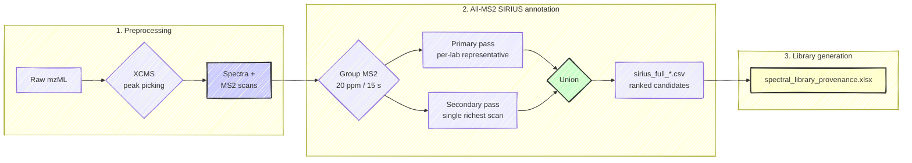

# HUMAN Ring Trial

This repository contains the analysis for the **Ring Trial study**, part of the
**HUMAN Doctoral Network's** main research efforts.

## 📖 Study Overview

**The goal of this branch is to build a spectral library** from the MetaSci
standard mixtures. Because each mixture's composition is known ahead of time, the
spike-in panel is annotated **fully automatically** — every MS2-bearing feature
is scored with SIRIUS, with no manual curation — and the confirmed annotations,
with their acquisition provenance, become the input the spectral library is
assembled from.

It is part of the wider **Ring Trial study** (HUMAN Doctoral Network), which
compares LC-MS setups across the participating laboratories (Afekta, Cembio,
HMGU, ICL) to understand where cross-lab variability comes from. The library
built here is the reference underpinning that comparison.

**Data:**

1. **Samples** — mixtures from the MetaSci metabolite standard library, so the
   ground-truth composition of each mixture is known.
2. **HUMAN reference method** — all labs analyse the same mixtures with a
   standardized method (common column and gradient); the **HE** class covered
   here uses this method.
3. **Lab-specific method** — each lab also runs its everyday protocol (used
   elsewhere in the study).

> **This branch is the fully automatic library-building track.** It runs from the
> preprocessed data straight to a SIRIUS annotation of every MS2-bearing feature
> and the spectral-library provenance that annotation produces, with **no manual
> curation**. The **semi-automated (expert-curated) annotation** and the
> **cross-lab reproducibility analysis** built on it live on the
> `semi-automated-and-downstream` branch, which carries its own README.
>
> Coverage is currently the **HE** chemical class; the other classes (FE, Others)
> follow the same pipeline and are being added.

-----

## 📂 Project Structure & Workflow

Three numbered folders, run in order, ending in the library: preprocess the raw
scans, annotate every MS2 feature with SIRIUS, then assemble the confirmed
annotations and their provenance into the spectral-library input.



### 🔹 1. Preprocessing (`1_preprocessing/`)

*Goal: convert raw data into processed `xcms` / `Spectra` objects.*

  * `generic_preprocessing.qmd` — template preprocessing script; `setup.R` loads
    packages and shared definitions.
  * `standards.xlsx` & `NAPS_info.xlsx` — the MetaSci panel (per-mixture spike-in
    composition, InChIKeys, neutral masses) and NAPS anchor details.
  * **Lab folders** (`afekta`, `cembio`, `hmgu`, `icl`) each contain an `HE`
    subfolder (standardized reference method) with the lab-specific
    `preprocessing_script.qmd`, the `seq_pos.xlsx` / `seq_neg.xlsx` sequence
    tables, and `naps.csv`. Raw mzML and the heavy `Spectra` objects are not
    tracked (see below).

### 🔹 2. All-MS2 SIRIUS Annotation (`2_annotation/sirius_all_ms2/`)

*Goal: annotate **every MS2-bearing feature** from every lab with SIRIUS, with no
cross-lab consensus and no manual curation.*

  * **`sirius_annotation_all_ms2_pg.qmd`** — the annotation producer. Every lab
    shares one **grouping** step: MS2 scans are merged by precursor m/z within
    20 ppm, then split wherever the retention-time gap exceeds 15 s, giving one
    feature per real precursor peak (representative precursor = the feature's
    median m/z). Each feature is annotated **twice** and the runs are combined:

    | pass | which scans SIRIUS sees |
    |---|---|
    | **primary** | per-lab representative (see table) |
    | **secondary** | the single richest scan, identical for every lab (the common baseline) |

    A compound counts as recovered if **either** pass finds it; neither is a
    superset of the other. Per-lab primary strategies and pre-steps:

    | lab | primary representative | MS1 isotope pattern | pre-step |
    |---|---|---|---|
    | **afekta** | richest scan **per collision energy** (~3 spectra) | yes | none |
    | **cembio** | **all scans** (cap 40) | yes, from its **separate MS1 injection** | attach isotope pattern (see below) |
    | **icl** | **all scans** (cap 40) | yes | re-derive precursor m/z with `estimatePrecursorMz()` (Waters mzML value is unreliable) |
    | **hmgu** | single richest scan | yes | precursor-abundance filter (`prec_thr` 300, max across the feature's scans) |

    *cembio's MS1* is the one non-obvious case: its MS2 injection carries no
    usable isotope pattern, but a **separate MS1 injection** (55 days apart, so no
    RT correspondence assumed) supplies one, searched per-feature in its own RT
    window and kept only if the M+1 peak is genuinely present.

    SIRIUS runs via **RuSirius**; per-lab, per-mixture output is
    `results/<pass>/sirius_full_<lab>_mix_<mix>.csv` (ranked structure candidates
    with CSI:FingerID / COSMIC scores). `results/` is **not tracked**.

  * **`run_cluster_standalone.R`** — a self-contained runner for the annotation
    on a cluster: it auto-discovers the `<lab>/<class>/` data next to itself,
    tolerates upper/lower-case lab directories, and reads the SIRIUS password from
    the `SIRIUS_PASSWORD` environment variable (never hard-coded).

  * **`results_summary.qmd`** — the recovery report: how many of each mixture's
    20 spike-in standards SIRIUS recovers **at any rank**, per lab and per pass,
    against the semi-automated curated workflow as a reference. It also documents
    the cembio MS1 rescue and the hmgu group-2 vial mislabel. It **renders on a
    fresh clone** from committed data only (see below).

  * **`reference/*_lab_annotations_sirius_curated.xlsx`** — the semi-automated
    curated annotations, kept here **only** as the comparison baseline for
    `results_summary.qmd` (the curation workflow itself lives on the other
    branch).

  * **`build_render_bundle.R`** + **`recovery_bundle.csv`** — the reproducible
    builder and the small committed CSV that let `results_summary.qmd` render its
    recovery tables without the (untracked) `results/` CSVs. Rerun the builder
    whenever the annotation results change. (The hmgu vial-mislabel figures are
    recomputed by the qmd directly from the raw hmgu mzML, so they are not
    precomputed here and are skipped if that mzML is absent.)

### 🔹 3. Library Generation (`3_library_generation/`)

*Goal: turn the SIRIUS annotations into the spectral library — the deliverable of
this branch.*

  * **`build_spectral_library_provenance.R`** reads the `results/` annotation
    CSVs and writes **`spectral_library_provenance.xlsx`** — the per-compound
    provenance table (lab, mixture, pass, ranks, scores) that ties every library
    entry back to the exact acquisition it came from. This provenance table is the
    input the spectral library is assembled from.

-----

## ▶️ Reproducing the results summary

The recovery tables read **only committed data** — `1_preprocessing/standards.xlsx`,
the four `2_annotation/sirius_all_ms2/reference/*.xlsx`, and `recovery_bundle.csv`
next to it — so a fresh clone renders them with `readxl` + `knitr` + `ggplot2`. The
hmgu vial-mislabel section additionally recomputes its evidence from the raw hmgu
mzML (needs the `Spectra` stack); it is skipped, and the rest still renders, if
that mzML is not present:

```bash
quarto render 2_annotation/sirius_all_ms2/results_summary.qmd
```

To regenerate those three CSVs from a local `results/` tree (and the hmgu mzML):

```bash
Rscript 2_annotation/sirius_all_ms2/build_render_bundle.R
```

## 🗃️ What is (and isn't) in the repository

**Tracked:** all `.qmd` / `.R` analysis code; the panel metadata
(`standards.xlsx`, `NAPS_info.xlsx`) and per-lab sequence tables; the
semi-automated curated reference xlsx; the small render-bundle CSVs; and the
`spectral_library_provenance.xlsx` output.

**Not tracked (local only):**

| Pattern | Why excluded |
|---|---|
| `*.mzML`, `*.raw`, `*.wiff`, `*.d/` | Raw instrument data — obtain per-lab from the original acquisitions. |
| `2_annotation/sirius_all_ms2/results/` | Per-lab SIRIUS annotation CSVs and `.sirius` project files — the panel-relevant summary is committed as the render bundle, and the full table lands in `spectral_library_provenance.xlsx`. |
| `*.html`, `*_cache/`, `.quarto/` | Rendered reports / caches — re-render from the QMDs. |
| `*.RData`, `*.rds` | `Spectra` objects and pipeline caches built from the raw mzML. |
| `run_sirius_cluster.R` | Local cluster runner that would hold the SIRIUS password — kept out of the repo; use `run_cluster_standalone.R` with `SIRIUS_PASSWORD` instead. |

A fresh clone has the full analysis **code**, the panel metadata, and everything
needed to render `results_summary.qmd`; re-running the SIRIUS annotation itself
requires the raw mzML (local, or shared on request) and a SIRIUS login.
