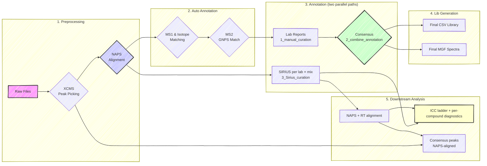
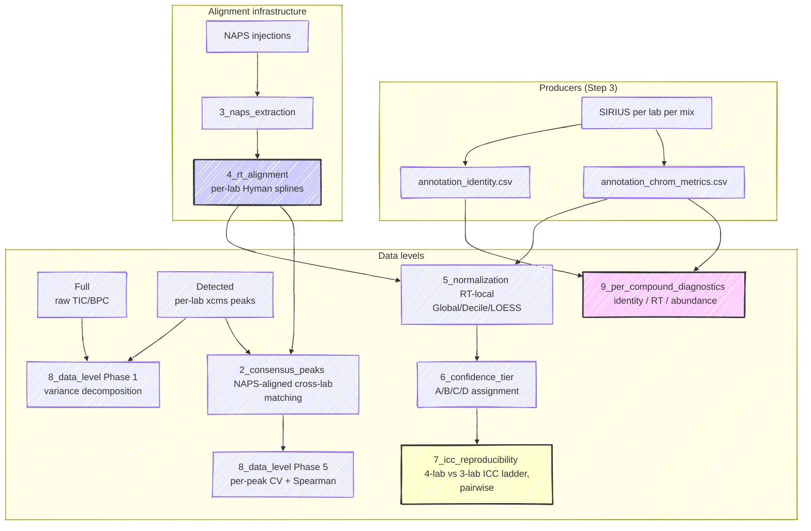

# HUMAN Ring Trial

This repository contains the analysis for the **Ring Trial study**, part of
the **HUMAN Doctoral Network's** main research efforts.

## 📖 Study Overview

The goal of this study is to understand the sources of variability between
different LC-MS setups used in metabolomics. We compare multiple LC-MS methods
across various participating laboratories (Afekta, Cembio, HMGU, ICL).

**The Experimental Design:**

1.  **Lab-Specific Method:** Each lab analyzes mixtures using their standard,
    everyday LC-MS protocol.
2.  **HUMAN Reference Method:** All labs analyze the same mixtures using a
    standardized method (common column and gradient).
3.  **Samples:** A total of **83 mixtures** from the MetaSci metabolite
    standard library are analyzed (Ground Truth is known).

-----

## 📂 Project Structure & Workflow

The analysis is divided into **5 sequential steps**, each corresponding to a
numbered folder in the repository.

:information_source: For most steps, the directory for the analysis step
contains a subfolder for each lab and within that, a folder per analyzed
standard mixture.

### 🔹 1. Preprocessing (`1_preprocessing/`)

*Goal: Convert raw data into processed xcms objects.*

  * **Generic Files:**
      * `generic_preprocessing.qmd`: A template script for preprocessing.
      * `setup.R`: Loads necessary packages and definitions.
      * `standards.xlsx` & `NAPS_info.xlsx`: MetaSci library and NAPS peak
        details.
  * **Lab Folders:** Each lab (e.g., `afekta`, `cembio`, `icl`, `hmgu`) has
    its own folder for analysis files. These contain subdirectories for each
    standard mixture set (e.g., `HE` for *human endosome*) with files:
      * `preprocessing_script.qmd`: The lab-specific analysis file.
      * `seq_pos.xlsx`: Sequence files.
      * `naps.csv`: Results of NAPS detection.
      * `mse` and `mse2` objects: *xcms* preprocessed R objects.

### 🔹 2. Automatic Annotation (`2_annotation_auto/`)

*Goal: Generate initial evidence for metabolite identification.*

  * **Process:** Uses the preprocessed objects to match MS1 adducts, isotopes,
  and MS2 spectra against libraries.
  * **Key Output:** `peak_evidence.csv` and `peak_evidence_rt_grouped.csv`
  (intermediate files used for the next step).

### 🔹 3. Manual Curation (`3_annotation_manual/`)

*Goal: Refine automatic annotations through expert review.*

This step has two parallel sub-pipelines that feed different downstream
deliverables:

#### Library-generation path (feeds Step 4)

1.  **Manual Curation (`1_manual_curation`):**
      * Contains `lab_report` files where labs reviewed the automatic data.
      * `fixed_lab_report/`: Scripts to standardize and fix formatting errors
        in manual reports.
2.  **Combine Annotation (`2_combine_annotation`):**
      * `compare_lab_sheet.R`: Merges the corrections.
      * `consensus_summary.xlsx`: The merged annotations.
3.  **Refinement Loop:**
      * Labs check the consensus results and review flagged compounds.
      * Labs manually integrate missing compounds.
      * Another round of annotation combining is performed to generate a final
        table for each lab and a final consensus table.

#### Cross-lab comparison path (feeds Step 5)

4.  **SIRIUS Curation (`3_Sirius_curation/sirius_annotation_all_ms2.qmd`):**
      * Per-lab × per-mixture SIRIUS pipeline (CSI:FingerID +
        COSMIC + bio-database). Inputs are the preprocessed mzML
        files from Step 1; outputs are the **canonical CSVs** the
        downstream analysis consumes:
          - `annotation_identity.csv` — one row per
            `(mixture, lab, compound, polarity)` with COSMIC scores
            and confidence tier (A/B/C/D, populated downstream).
          - `annotation_chrom_metrics.csv` — MS1 chromatogram
            metrics (peak intensity, area, FWHM, SNR) for every
            annotated compound × adduct, including
            consensus-prior-extracted peaks for compounds a lab
            missed via MS2 but other labs confirmed.
      * Uses a **cluster-based consensus-RT algorithm** to resolve
        the per-compound RT prior across labs / polarities, and
        an **SNR-aware peak picker** to avoid noise-grab false
        positives. See the QMD's preamble for current settings.

### 🔹 4. Library Generation (`4_library_generation/`)

*Goal: Produce the final, clean spectral libraries.*

  * **Input:** The consensus data from Step 3.
  * **Script:** `lib_gen_HE.qmd` (run per lab).
  * **Final Outputs:**
      * `ring_trial_library_HE.csv`: The final library table.
      * `std_spectra_HE.mgf`: The MS/MS spectra in MGF format.

### 🔹 5. Downstream Analysis (`5_downstream_analysis/`)

*Goal: Quantify cross-lab reproducibility at each data level (Full →
Detected → Annotated → Consensus) and produce the ring-trial
comparison numbers (ICC, pairwise correlations, per-compound
diagnostics) used in the manuscript.*

Inputs are the canonical CSVs from Step 3's `3_Sirius_curation/`
producer; outputs are rendered HTML reports per QMD plus shared
intermediates in `5_downstream_analysis/object/`. Render order matters
because of producer/consumer chains.

  * **`1_full_detected_objects.qmd`** — loads preprocessed `Spectra`,
    BPC, and TIC objects per lab. Producer for the Full/Detected data
    levels.
  * **`2_consensus_peaks.qmd`** — pools per-lab xcms-detected peaks,
    applies NAPS-spline alignment (with raw-RT fallback for
    out-of-range peaks), and builds the cross-lab consensus feature
    table. Includes a sanity-check section mapping SIRIUS-annotated
    spike-ins to consensus features.
  * **`3_naps_extraction.qmd`** — producer for `4_rt_alignment`. Runs
    the SNR-aware chromExtract on NAPS injections; writes
    `naps_chrom_metrics.csv`.
  * **`4_rt_alignment.qmd`** — per-lab Hyman monotonic spline aligning
    each lab's NAPS apex RTs to the cross-lab consensus, optionally
    extended with co-identified standards as additional anchors.
    Writes `rt_alignment_splines.RData` for the downstream consumers.
  * **`5_normalization.qmd`** — applies the splines to all detected
    peaks; computes per-(lab, sample, polarity, decile) intensity
    factors (Global / Decile / LOESS) and writes the normalized
    annotated abundance table.
  * **`6_confidence_tier.qmd`** — assigns A/B/C/D tiers per
    `(mixture, compound, polarity)` using COSMIC scores +
    cross-lab RT-SD axis; writes back into
    `annotation_identity.csv`.
  * **`7_icc_reproducibility.qmd`** — ICC ladder (4-lab vs 3-lab
    subsets, Strict vs Inclusive alignment quorum), pairwise lab
    correlation, leave-one-out consensus.
  * **`8_data_level_progression.qmd`** — variance decomposition and
    PCA progression across the four data levels. Phase 1 (Full →
    Detected → Annotated bulk metrics) + Phase 5 (per-consensus-peak
    metrics).
  * **`9_per_compound_diagnostics.qmd`** — identity / retention /
    abundance diagnostics at the per-compound level. Includes
    explainer sections on cembio block-MS2 acquisition and hmgu DDA
    open-precursor selection.

See `5_downstream_analysis/CANONICAL_SCHEMAS.md` for the column
contracts on the shared CSVs and `5_downstream_analysis/MANUSCRIPT_NOTES.md`
for the current headline numbers + framing decisions.

-----

## 🗃️ Reproducing the downstream analysis

Cloning the repository gives you everything needed to **re-render** Step 5
QMDs from `5_normalization.qmd` onward without re-running SIRIUS or
xcms — the canonical CSVs (`annotation_chrom_metrics.csv`,
`annotation_identity.csv`, `naps_chrom_metrics.csv`,
`annotation_chrom_metrics_normalized.csv`, the `detected_peaks_*_HE.csv`
xcms outputs, `rt_alignment_splines.RData`, and most of the smaller
`*.RData` objects) are all tracked.

A few preprocessed Spectra objects exceed GitHub's 100 MB per-file
limit and are excluded by `.gitignore`. They are needed only for
`1_full_detected_objects.qmd` and Phase 1 of `8_data_level_progression.qmd`:

| File | Size | Used by |
|---|---:|---|
| `5_downstream_analysis/object/sp_full.RData` | ~10 GB | QMD 1 + 8 Phase 1 |
| `5_downstream_analysis/object/sp_full_detect.RData` | ~206 MB | QMD 1 + 8 Phase 1 |
| `5_downstream_analysis/object/sp_icl.RData` | ~128 MB | QMD 1 |
| `5_downstream_analysis/object/correspondence_grouped*.rds` | ~60-70 MB each | QMD 2 (regenerated on first render, ~5 min) |

If you need to render those specific QMDs, either:

1. **Regenerate locally** from the upstream raw data + preprocessing
   scripts (`1_preprocessing/`). Requires the lab's raw mzML files.
2. **Contact the repo maintainer** ([philoulouail@gmail.com](mailto:philoulouail@gmail.com))
   to obtain the prebuilt `sp_*.RData` files via an out-of-band share
   (OneDrive / Zenodo).

The QMDs from `5_normalization.qmd` onward render without these large
files — they read only the tracked canonical CSVs.

## 🛠️ Usage

To reproduce the analysis or adapt it to new data, follow the numerical order
of the folders.

### For a New Analysis:

1.  **Setup:** Run `1_preprocessing/setup.R` to install dependencies and load
    helper functions.
2.  **Preprocessing:** Copy `1_preprocessing/generic_preprocessing.qmd` and
    adapt it to your file paths.
3.  **Annotation:** Run the `generic_automatic_annotation.qmd` located in
    `2_annotation_auto/` to generate your evidence tables.

### For the Ring Trial Reproduction:

Data is organized by lab (`afekta`, `cembio`, `hmgu`, `icl`) and method (`HE`
for Human Extract/Standardized). You must run the `.qmd` file within the
specific lab subfolder to regenerate that specific part of the analysis.

> ⚠️ **Note on Intermediate Files:**
> The pipeline generates several intermediate objects (e.g., inside
`2_annotation_auto/.../peak_evidence.csv`). These are not final results. Always
 refer to folder `4_library_generation` for the final libraries,
 `5_downstream_analysis` for the comparative results, and the **final consensus table in Step 3**.

-----

## 📊 Comparison Logic

The downstream analysis (`5_downstream_analysis`) computes the ring-trial
comparison numbers across **four data levels**, from raw chromatograms
through cross-lab matched consensus peaks. Each level answers a
different question; together they decompose where cross-lab variance
comes from.

**Four data levels**, in order of increasing curation:

| Level | What | Cross-lab variance | Output |
|---|---|---:|---|
| **Full** | All MS1 ions, no peak detection | ~ 98 % lab effect | `bpc_full`, `tic_full` |
| **Detected** | Per-injection xcms peaks | ~ 89 % lab effect | `detected_peaks_{lab}_HE.csv` |
| **Annotated** | The SIRIUS-confirmed spike-in panel | ~ 47 % lab effect | `annotation_chrom_metrics_normalized.csv` |
| **Consensus** | Cross-lab matched features (NAPS-aligned) | per-peak | `peak_metrics_detected_all4labs.csv` |

The drop from ~ 98 % to ~ 47 % lab variance going from Full to
Annotated is the ring trial's headline finding: identity-anchored
analysis substantially recovers cross-lab comparability.
